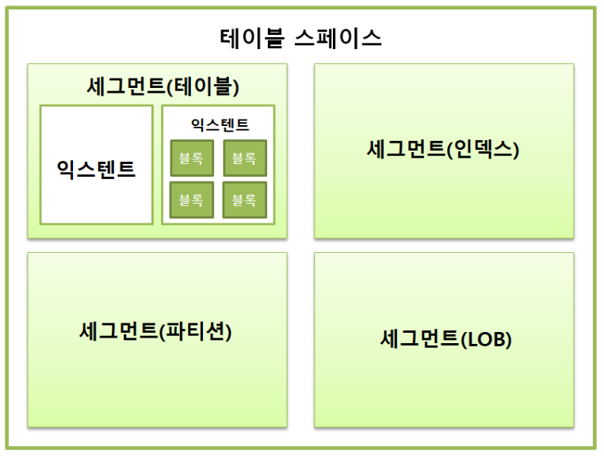
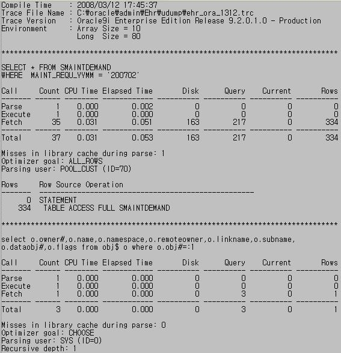
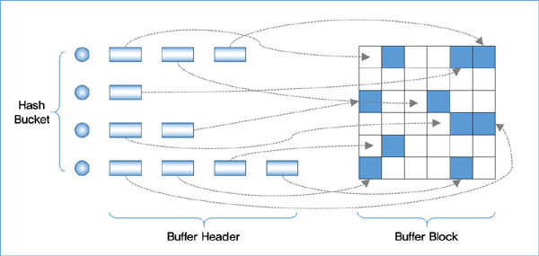

# 데이터 저장 구조 및 I/O 메커니즘

- OS 또는 I/O 서브시스템이 I/O를 처리하는 동안 프로세스는 잠을 잔다.
- 위와 같은 이유로 SQL이 느린 이유는 디스크 I/O 때문이다.

## 프로세스 생명주기

- 생성 -> (READY, RUNNING, WATING) 이와 같은 상태를 종료전까지 반복한다.
- 프로세스가 실행 중 디스크에서 데이터를 읽어야 할 때는 CPU를 OS에 반환하고 수면상태(WATING) 상태에 들어가 I/O가 완료되기를 기다린다.
- 정해진 OS 함수 호출 -> CPU 반환 -> 알람 설정 -> 대기 큐에서 WATING 상태 대기

### 속도

- I/O Call 속도는 Single Block I/O 기준으로 평균 10ms 쯤 된다. 즉 초당 100블록쯤 읽는 셈이다.
- SAN 스토리 4~8ms 초당 125~250 블록
- SSD 스토리지는 1~2ms 초당 500~1000 블록
- 이러한 속도에서 수많은 프로세스에 의해 동시다발적으로 발생하는 I/O Call 때문에 디스크 경합이 심해지면서 대기 시간도 늘어나면서 SQL이 느려진다.

## 테이블스페이스

- 테이블스페이스는 세그먼트를 담는 콘테이너로서, 여러 개의 데이터파일로 구성된다.
- 즉 테이블을 생성할 때 저장되는 테이블 스페이스를 지정이 가능하며, 데이터, 인덱스 등을 테이블 스페이스로 구분하여 관리할 수 있다.
- DB > 테이블 스페이스 > TABLE
- 오라클에서는 직접 테이블 스페이스를 생성 후 지정하지만, Mysql에서는 테이블마다 자동으로 테이블 스페이스가 지정이되서 따로 생성할 필요가 없다.

### 세그먼트

- 데이터 저장공간이 필요한 오브젝트(테이블, 인덱스, 파티션, LOB 등)
- 여러개의 익스텐트로 구성

### 익세텐트

- 한 인스텐스는 하나의 테이블이 독점(인스텐스에 담긴 블록은 모두 같은 테이블), MS-SQL Server는 한 인스텐트를 여러 오브젝트가 같이 사용이 가능하다.
- 공간을 확장하는 단위, 연속된 블록들의 집합
- 테이블이나 인덱스에 데이터를 입력하다가 공간이 부족해지면 해당 오브젝트가 속한 테이블스페이스로 부터 익스텐트를 추가로 할당을 받는다.

### 블록

- 데이터를 읽고 쓰는 단위
- 사용자가 입력한 레코드를 실제로 저장하는 공간
- DB2, SQL Server 같은 DBMS에서는 페이지라고도 불린다.
- 한 블록은 한 테이블이 독점(한 블록에 저장된 레코드는 모두 같은 테이블 레코드)

### 분사 저장 처리

- 세그먼트에 공간이 부족해지면 테이블스페이스로부터 익세텐트를 추가로 할당받는다 하지만 세그먼트에 할당된 모든 익스텐트가 같은 데이터파일에 위치 하지 않을 확률이 높다.
- 하나의 테이블스페이스를 여러 데이터 파잉로 구성하면, 파일 경합을 줄이기 위해 DMBS가 데이터를 가능한 한 연러 데이터파일로 분산해서 저장한다.

### DBA

- DBA(Data Block Address)는 블록 자신만의 고유 주소 값이다.
- 디스크 상에서 몇번 데이터파일의 몇 번째 블록인지를 나타낸다.
- 인덱스를 이용해 테이블 레코드를 읽을 때는 인덱스 ROWID(DBA + 로우번호(블록내 순번))를 이용한다.

## 시퀀셜 액세스 vs 랜덤 액세스

### 시퀀셜 액세스

- 논리적 또는 물리적으로 연결된 순서에 따라 차례대로 블록을 읽는 방식이다.
- 세그먼트 헤더에 익스텐트 정보를 Map으로 가지고 있고 해당 익세텐트의 첫 Block 부터 연속해서 읽게되 시퀀셜액세스가 가능하고 이러한 방식을 Full Table Scan이라고 한다.

### 랜덤 액세스

- 논리적 또는 물리적인 순서를 따르지 않고 레코드 하나를 읽기 위해 한 블록씩 접근하는 방식이다.

## 논리적 I/O vs 물리적 I/O

### DB 버퍼캐시

- 디스크에서 어렵게 읽은 데이터 블록을 캐싱해 둠으로써 같은 블록에 대한 반복적인 I/O Call을 줄이는데 목적이 있다.
- 프로세스 -> 버퍼캐시 -> 데이터파일 만약 여기서 버퍼캐시에 데이터가 없으면 데이터파일까지 가서 물리적 I/O가 실행이되면서 프로세스가 잠들게된다.

### 논리적 I/O

- SQL문을 처리하는 과정에 메모리 버퍼캐시에서 발생한 총 블록 I/O

### 물리적 I/O

- 디스크에서 발생한 총 블록 I/O 즉 딕스크 I/O
- SQL 처리 도중 읽어야 할 블록을 버퍼캐시에서 찾지 못할 때만 디스크를 액세스하므로 논리적 블록 I/O 일부를 물리적 I/O 한다.
- 디스크 I/O는 암(Arm)을 통해 물리적 작용이 일어나므로 메모리 I/O에 비해 10,000배 쯤 느리다.

### 버퍼캐시 히트율

- BCHR(Buffer Cache Hit Ratio) 물리적인 디스크 읽기를 수반하지 않고 곧바로 메모리에서 블록을 찾은 비율을 말한다.
- BCHR = (캐시에서 곧바로 찾은 블록 수 / 총 읽은 블록 수) X 100 = (( 논리적 I/O - 물리적 I/O) / 논리적 I/O) X 100 = ( 1 - (물리적 I/O) / (논리적 I/O)) X 100
- 물리적 I/O가 성능을 결정하지만 실제 SQL 성능 향상하려면 물리적 I/O가 아닌 논리적 I/O를 줄여야 한다.
- 물리적 I/O = 논리적 I/O x (100 - BCHR) 즉 물리적 I/O는 BCHR에 의해 결정된다.
- BCHR은 시스템 상황에 따라 달라지므로 물리적 I/O는 결국 시스템 상황에의해 결정되는 통제 불가한 "외생변수"다.
- 논리적 I/O는 항상 일정하게 발생하지만 SQL 튜닝을 통해 줄일수있는 통제 가능한 "내생변수" 이며 즉 _논리적 I/O를 줄임으로써 물리적 I/O를 줄이는 것이 곧 SQL 튜닝이다._

#### 계산 방법

- 디스크에서 163개 메모리에서 217개(217 + 0)개 블록을 읽었으므로 논리적 I/O는 총 217개이며 물리적 I/O는 163개이다.
- BCHR = (1 - (DISK / Query + Current)) X 100 = (1 - (163 / (217 + 0))) X 100 = 24.8%

## Single Block I/O vs Multiblock I/O

- 캐시에서 찾지 못한 데이터 블록은 I/O Call을 통해 디스크에서 DB 버퍼캐시로 적재하고서 읽는다.

### Single Block I/O

- 한 번에 한 블록씩 요청헤서 메모리에 적재하는 I/O Call 방식을 말한다.
- 인덱스를 이용할 때는 기본적으로 인덱스와 테이블 블록 모두 Single Block I/O 방식을 사용한다.

### Multiblock I/O

- 한 번에 여러 블록씩 요청해서 메모리에 적재하는 I/O Call 방식을 말한다.
- 테이블 전체를 스캔할 때는 Multiblock I/O 방식을 사용한다.

## Table Full Scan vs Index Range Scan

### Table Full Scan

- 시퀀셜 액세스와 Multiblock I/O 방식으로 디스크 블록을 읽는다.
- 한 번의 수면을 통해 인접한 수십~수백 개(1MB(오라클 레벨 I/O 단위))를 한꺼번에 I/O하는 매커니즘이다.
- 이 방식을 사용하는 SQL은 스토리지 스캔 서능이 좋을수록 같이 좋아진다.

### Index Range Scan

- 랜덤 액세스와 Single Block I/O 방식으로 디스크 블록을 읽는다.
- 레코드 하나를 읽기 위해 매번 잠을 자는 I/O 매커니즘이다.

### 정리

- 많은 데이터를 읽을 때는 Index Range Scan 방식이 불리하다, 따라서 스토리 엔진이 아무리 좋아져도 해당 방식으로는 성능이 조금 밖에 좋아지지 않는다.
- 항상 Index가 빠르고 옳은게 아니면 Table Full Scan이 항상 나쁜것도 아니다.
- 읽을 데이터가 일정량을 넘으면 인덱스보다 Table Full Scan이 유리하다.

## 캐시 탐색 메커니즘

- Direct Path I/O를 제외하고는 모든 블록 I/O는 메모리 버퍼캐시를 경유한다.

### 해당 오퍼레이션

- 인덱스 루트 블록을 읽을 때
- 인덱스 루트 블록에서 얻은 주소 정보로 브랜치 블록을 읽을 때
- 인덱스 브랜치 블록에서 얻은 주소 정보로 리프 블록을 읽을 때
- 인덱스 리프 블록에서 얻은 주소 정보로 테이블 블록을 읽을 때
- 테이블 블록 Full Scan 할 때

### 메모리 공유자원에 대한 액세스 직렬화

- 버퍼캐시는 SGA 구성요소이므로 버퍼캐시에 캐싱된 버퍼블록은 모두 공유자원이다.
- 만약 하나의 버퍼블록에 두개이상의 프로세스가 동시에 접근할시에 정합성 문제가 발생할수 있기에 직렬화 메커니즘이 필요하다.

### 캐시버퍼 체인 래치

- A 프로세스가 해시 체인을 스캔하는 동안 다른 프로세스가 체인 구조를 변경하면 안되기에 체인들은 래치에 의해 보호된다.

### 버퍼 Lock

- 랠치를 해제한 상태로 버퍼블록 데이터를 읽고 쓰는 도중에 후행 프로세스가 같은 블록에 접근해서 데이터를 읽거나 쓰게되면 문제가 생기기에 버퍼 Lock을 사용한다.
