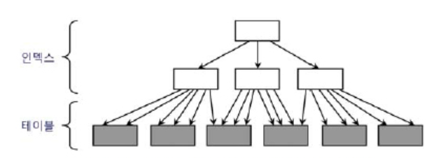
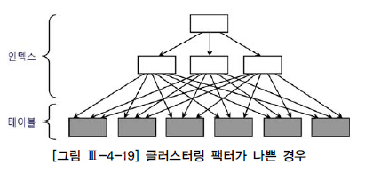
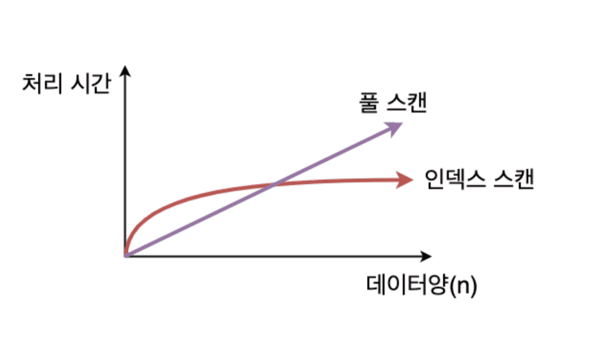

# 테이블 액세스 최소화

- SQL 성능 향상을 위해 DBMS가 제공하는 많은 기능이 느린 랜덤 I/O를 극복하기 위해 개발되었다.

## 테이블 랜덤 액세스

- 아무리 데이터가 많아도 Index를 타면 빠르지만 인덱스를 타도 대량 데이터를 가져오면 인덱스를 타는것보다 테이블 스캔이 빠르다.

### 인덱스 ROWID는 물리적 주소? 논리적 주소?

- index를 스캔하는 이유는, 검색 조건을 만족하는 소량의 데이터를 인덱스에서 빨리 찾고 거기서 테이블 레코드를 찾아가기 위한 주소 값, 즉 ROWID를 얻으려는데에 있다.
- ROWID는 데이터파일 번호, 오브젝트 번호, 블록 번호같은 물리적인 요소로 구성돼 있어서 물리적 주소라고 생각할 수 있지만 아니다.
- 물리적으로 직접 연결되지 않고 테이블 레코드를 찾아가기 위한 논리적 주소 정보를 담고 있기 때문이다.

#### ROWID 와 포인터

- 포인터도 메모리 주소를 값을 담는 변수를 말하고 ROWID 또한 테이블 레코드를 찾아가기 위한 논리적 주소 정보를 담고 있다.
- 하지만 이 둘은 엄연히 다르면 테이블 레코드와 물리적으로 직접 연결된 구조는 아니다.

1. 포인터는 물리적 주소
2. ROWID는 논리적 주소

### 메인 메모리 DB와 비교

- 메인 메모리 DB(MMDB)는 데이터를 모두 메모리에 로드해 놓고 메모리를 통해서만 I/O를 수행하는 DB 이다.
- 어떤 메인 메모리 DB 경우에는 인스턴스를 기동하면 디스크에 저장된 데이터를 버퍼캐시로 로딩하고 이어서 인덱스를 생성한다, 이 떄 인덱스는 오라클과 같은 DB처럼 디스크 상의 주소정보를 갖는 게 아닌 메모리상의 주소정보, 즉 포인터를 갖는다.
- 이에 따라서 인덱스를 경유해 테이블을 액세스하는 비용이 오라클과 같은 DB와 비교할 수 없을 정도로 낮다.
- 오라클은 수시로 데이터블록이 버퍼캐시에 밀려 났다가 다시 캥시되며 그 떄 마다 다른 공간에 캐싱되서 인덱스에서 포인터로 직접 연결할 수 없는 구조이다.

### I/O 매커니즘 복습

- 블록을 읽기 전에는 버퍼캐시 -> 디스크 다.
- 캐시에 적재 및 읽을 떄는 같은 해시 함수를 사용하므로 버퍼 헤더는 항상 같은 해시 체인에 연결된다.
- 버퍼블록(실제 데이터)은 매번 다른 위치에 캐싱이되며 이를 찾기 위해 주소 값을 가진 버퍼헤더에서 얻은 포인터로 버퍼 블록을 찾아간다.
- 인덱스 테이블 블록 액세스: 리프 블록 READ -> ROWID 분해 -> DBA 정보 READ
- 테이블 풀스캔은 익스텐트 맵을 통해 읽을 블록들의 DBA 정보를 얻는다.
- 모든 데이터가 해싱이 되었다 하더라도 DBA 해싱과 래치 획득 과정은 반복해야한다.

### 인덱스 ROWID는 우편주소

- 디스크 DB(오라클)가 사용하는 ROWID를 우편주소, 메인 메모리 DB 포인터를 전화번호에 비유할수 있다.
- 전화통신은 물리적으로 연결된 통신망을 이용하므로 곧바로 상대방과 통화가 가능하다.
- 우편통신은 보퉁에 적힌 대로 일일이 찾아다녀야 되므로 전화와 비교할 수 없이 느리다.

#### 예시

- 우편주소: 서울시 중구 무교동 123번지 OO 타워 10층
- ROWID: 7번 데이터 파일 123번 블록에 저장된 10번쨰 레코드

## 인덱스 클러스터링 팩터

- 클러스터링 팩터(CF)는 특정 컬름 기준으로 같은 값을 갖는 데이터가 서로 모여있는 의미로 생각하면 된다.
- CF가 좋은 컬럼에 생성한 인덱스는 검색 효율이 매우 좋다 이는 테이블 액세스량에 비해 블록 I/O 적게 발생함을 의미 한다.
- 예시로 "거주지역=제주"에 해당하는 고객 데이터가 물리적으로 근접해 있으면 흩어져 있을 때 보다 데이터를 찾는 속도가 빠르다.




## 인덱스 손익분기점



- 인덱스 ROWID를 이용한 방식은 고비용 구조이며 따라서 읽어야 할 데이터가 일정량을 넘으면 테이벌 전체 스캔을 하는것보다 느리다.
- 즉 Index Range Scan에 의한 테이블 액세스가 Table Full Scane 보다 느려지는 지점을 '인덱스 손익분기점'이라고 부른다.
- 또한 인덱스 CF가 낮으면 여러번 박복 액세스하면서 논리적, 물리적 I/O 횟수가 늘어나게된다.

### 성능 비교

- Table Full Scan은 시퀀셜 액세스인 반면 인덱스 ROWID를 이용한 테이블 액세스는 랜덤 액세스 방식이다.
- Table Full Scan은 Multiblock I/O인 반면, 인덱스 ROWID를 이용한 테이블 액세스는 Single Block I/O 방식이다.

### 인덱스 손익분기점 버퍼캐시 히트율

- 10만정도되는 테이블에서 10%는 1만이다고 여기서 버퍼캐시에 데이터를 찾을 가능성이 어느정도있으며 이정도 크기면 CF도 어느정도 형성이 되어있을것이다, 이에 따라 버퍼캐시 히트율이 어느정도 있을것이다. 하지만 1000만건 테이블에서 10%는 100만이고 이 많은 데이터를 버퍼캐시에 찾을 가능성이 낮으며 이 상황에서 손익분기점 자체가 의미가 없어지며 이정도 데이터 양이면 CF 또한 형성이 안되어있으며 버퍼캐시 히트율도 극히 낮을것이다.

- 즉 항상 Index 스캔이 좋은게 아니며 항상 테이블 풀 스캔이 나쁜것은 아니다.

### 온라인 프로그램 튜닝 vs 배치 프로그램 튜닝

- 온라인 프로그램은 보통 소량 데이터를 읽고 갱신하므로 인덱스를 효과적으로 활용하는 것이 중요하며 조인도 대부분 NL(인덱스 조인) 조인 방식을 사용하며 인덱스를 이용해 소트 연산을 생략함으로 써 부분범위 처리 방식을 구현할 수 있다면 온라인 환경에서도 대량 데이터를 조회할때도 빠른 응답 속도를 낼 수 있다.
- 배치프로그램은 항상 전체 범위 처리 기준으로 튜닝해야 한다. 즉 처리대상 집합 중 일부를 빠르게 처리하는게 아닌 전체를 빠르게 처리하는 것을 목표로 삼아야한다. 이에 따라 대용량 데이터를 빠르게 처리하면 인덱스와 NL 조인보다 Full Scan과 해시 조인이 유리하다.

- 튜닝 전

```sql
insert into 고객_임시
select c.고객번호, c.고객명, h.전화번호, h.주소, h.상태코드, h.변경일시
from 고객 c, 고객변경이력 h
and h.고객번호 = c.고객번호
and h.변경일시 = (select max(변경일시) from 고객변경이력 where 고객번호 = c.고객번호 and 변경일시 >= trunc(add_months(sysdate, -12), 'mm') and 변경열시 < trunc(sysdate, 'mm'))
```

- 예를 들어 전체 300만명 중 고객구분코드 조건을 만족하는 고객이 100만명이라면 위 조건은 결코 빠른 성능을 낼수 없다.

- 튜닝 후

```sql
insert into 고객_임시
select /*+ full(c) full(h) index_ffs(m.고객변경이력) ordered no_merge(m) use_hash(m) use_hash(h) */
c.고객번호, c.고객명, h.전화번호, h.주소, h.상태코드, h.변경일시
from 고객 c,
(select 고객번호, max(변경일시) 최종변경일시 from 고객변경이력)
```

- 위와같이 Full Scan과 해시조인을 사용해야 효과적이다.

- 배치프로그램에서는 인덱스보다 Full Scan이 효과적이지만 초 대용량 테이블 경우에는 Full Scan 또한 상당히 오래시간을 기다려야 한다.
- 따라서 배치프로그램은 파티셔닝 활용이 매우 중요하며 거기에 병렬 처리까지하면 성능이 좋아진다.

## 인덱스 컬럼 추가

- 테이블 액세스 최소화를 위해 가장 일반적으로 사용하는 튜닝 기법은 인덱스에 컬럼을 추가하는것이다.
- 실 운영환경에서는 인덱스를 변경하기가 쉽지 않아 기존 인덱스에 SAL 컬럼을 추가하는 것만으로 큰 효과를 얻을 수 있다.

## 인덱스만 읽고 처리

```sql
select 부서번호, sum(수량)
from 판매집계
where 부서번호 like '12%'
group by 부서번호;
```

- 위 쿼리는 인덱스 문제가 아닌 일량이 많아서 느리다, 해당 쿼리를 튜닝하는 방법은 쿼리에 사용된 모든 컬럼을 인덱스에 추가해서 테이블 액세스가 아예 발생하지 안헥 하는 방법을 고려해보는 거다. 이렇게 인덱스만 읽어서 처리하는 쿼리를 'Covered 쿼리'라고 부른다.

### include 인덱스

- include 기능은 인덱스 키 외에 미리 지정한 컬럼을 리프 레벨에 함께 저장하는 기능이다. 인덱스를 생성할 때 아래와 같이 include 옵션을 지정하면 되며 컬럼은 최대 1023개까지 저장이 가능하다.
- include 기능은 순전히 테이블 랜덤 액세스를 줄이는 용도로 개발이 되었다.

```sql
create index emp_x01 on emp (deptno) include (sal)
```
