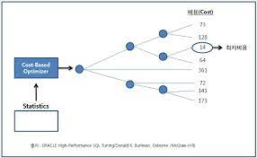

# SQL 파싱과 최적화

- SQL를 알기전 옵티마이저가 SQL를 어떻게 처리하는지, 서버 프로세스는 데이터를 어떻게 읽고 저장하는지를 알아야 한다.

## 구조적, 집학적, 선의적 질의 언어

- SQL은 'Structured Query Language'의 줄임말이다. 말 그대로 구조적 질의 언어이다.
- SQL은 기본적으로 구조적이고, 집학적이고 선언적인 질의 언어이다.
- 원하는 결과집합을 구조적, 집하적으로 선언하지만, 그 결과집합을 만드는 과정은 절차적일 수 밖에 없다.
- 즉 이러한 과정을 위해서 프로시저가 필요하며, 이러한 프로시저를 만들어내는 DBMS 내부 엔진이 SQL 옵티마이저이다.

### 옵티마이저 프로세스


## SQL 최적화

- DBMS 내부에서 프로시저를 작성하고 컴파일해서 실행 가능한 상태로 만드는 것을 'SQL 최적화' 라고 한다.

### 1. SQL 파싱

- 클라이언트(사용자)로부터 SQL을 전달받으면 가장 먼저 SQL 파서가 파싱을 진행한다.

### SQL 파싱 프로세스

#### 파싱 트리 생성

- SQL 문을 이루는 개별 구성요소를 분석해서 파싱 트리 생성

#### Syntax 체크

- 문법적 오류가 없는지 확인, 사용할 수 없는 키퉈를 사용했거나 또는 순서가 바르지 않거나 누락된 키워드가 있는 지 확인

#### Semantic 체크

- 의미상 오류가 없는 확인, 존재하는 테이블 또는 컬럼을 사용했는지, 사용한 오브젝트에 권한이 있는 확인

### 2. SQL 최적화

- SQL 최적화 단계는 옵티마이저가 해당 역할을 맡는다.
- SQL 옵티마이저는 미리 수집한 시스템 및 오브젝트 통계정보를 바탕으로 다양한 실행경로를 생성해서 비교한 후 가장 효율적인 하나를 선택한다.
- 데이터베이스 성능을 결정하는 가장 핵심적인 엔진이다.

### 3. 로우 소스 생성

- SQL 옵티마이저가 선택한 실행경로를 실제 실행 가능한 코드 또는 프로시저 형태로 포멧팅 하는 단계 이다.

### 처리 과정

- SQL을 싱행하기 위해서는 사전에 SQL 파싱과 최적화 과정을 거쳐야한다.
- SQL 파싱과 SQL 최적화 단계를 같이 'SQL 최적화' 라고 표현해도 무방하다.

## SQL 옵티마이저

- 사용자가 원하는 작업을 가장 효율적으로 수행할 수 있는 최적의 데이터 액세스 경로를 선택해주는 DBMS 핵심 엔진이다.

### 옵티마이저 최적화 단계 프로세스

1. 사용자로부터 전달받은 쿼리를 수행하는 데 후보군이 될만한 실행계획들을 찾아낸다.
2. 데이터 딕셔너리에 미리 수집해 둔 오브젝트 통계 및 시스템 통계정보를 이용해 각 실행계획의 예상비용을 산정한다.
3. 최저 비용을 나타내는 실행계획을 선택한다.



- SQL 옵티마이저는 별도 프로세스가 아닌 백그라운드 프로세스라고 생가하면 된다.
- 이 와같은 개념은 SQL 파서와 로우소스 생성기도 마찬가지다.

## 실행계획과 비용

- 네비게이션 처럼 경로를 미리보는거처럼 DBMS에도 'SQL 실행경로 미리보기' 기능이 있다.
- 이러한 기능이 '실행계획(Execution Plan)이 바로 그것이다.
- 실행계획을 통해 작성한 SQL이 테이블을 스캔하는지 인덱스를 스캔하는 인덱스를 스캔한다면 어떤 인덱스인지를 확인할 수 있다.

## 옵티마이저 힌트

- 네비게이션이 아무리 최적화된 경로를 보여준다고 하지만 운전자의 경험과 운전실력에 따라 최적화된 경로가 아닐 수 있다. 이거는 DBMS에서도 마찬가지이다.

### 힌트 사용법

- 힌트 사용법은 아래와 같이 주석기호에 '+'를 붙이면 된다.

```sql
/* GOOD */
SELECT /*+ INDEX(A 고객_PK)*/
    고객명, 연락처, 주소, 가입일시
    FROM 고객A
WHERE 고객 ID='00000008';
```

```sql
/* BAD */
SELECT --+ INDEX(A 고객_PK)
    고객명, 연락처, 주소, 가입일시
    FROM 고객A
WHERE 고객 ID='00000008';
```

- 코딩하는 과정에 줄바꿈 오류가 발생할 수 있기 때문이다.

#### 주의 사항

- 힌트 안에 인자를 나열할 땐 ','를 사용할 수 있지만, 힌트와 힌트 사이에 사용하면 안된다.

```sql
/*+ INDEX(A A_X01) INDEX(B, B_X03)*/ -> 모두 유효
/*+ INDEX(C), FULL(D) */ -> 첫 번째 힌트만 유효
```

```sql
SELECT /*+ FULL(SCOTT.EMP)*/ -> 무효
 FROM EMP;
```

- 위와 같이 스키마(데이터베이스)명까지 명시하면 안된다.

```sql
SELECT /*+ FULL(EMP)*/
 FROM EMP E;
```

- FROM 절 테이블 명 옆에 ALIAS를 지정했다면, 힌트에도 반드시 ALIAS를 사용을 해야한다.

### 자율 or 강제

- 옵티마이저도 실수를 하며 이러한 실수 때문에 기업에 막대한 손실이 있다면 옵티마이저의 자율적 선택에 모든거를 맡기자는 말은 할 수 없다.
- 만약 힌트를 쓴다고하면 빈트없이 기수를 하는 것이 좋다.
