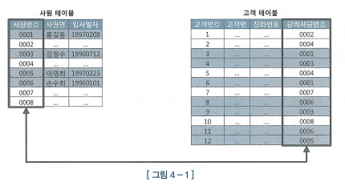
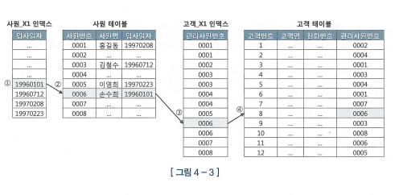
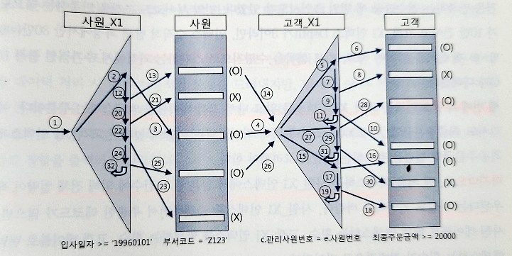

# NL 조인

- 조인의 기본은 NL 조인이며, NL 조인은 인덱스를 이용한 조인이다.

## 기본 메커니즘



```sql
select e.사원명, c.고객명, c.전화번호
from 사원 e, 고객 c
where e.입사일자 >= '19960101'
and c.관리사원번호 = e.사원번호
```

- 위 SQL문을 사용하면 원하는 결과값을 쉽게 추출할수있지만 SQL이 탄생하기전에는 두 테이블 조인을 개발자가 직접 작성해야만 했다.
- 쉽게 사원 테이블로부터 1996년 1월 1일 이후 입사한 사원을 찾아 '건건이' 고객 테이블에서 사원번가 일치(사원.사원번호 = 고객.관리사원번호)하는 레코드를 찾는 것이며 이것을 Nested Loop 조인이 사용하는 알고리즘이다.

```javascript
for(let i = 0; i < 100; i+>) { // outer loop
    for(let j = 0; j < 100; j++) { // inner loop
        // Do Anythingh ...
    }
}
```

- NL 조인은 위 중첩 루프문과 같은 수행 구조를 사용한다.
- 보통 NL 조인은 Outer, Inner 양쪽 테이블 모두 인덱스를 이용한다.
- Outer 테이블(::example "사원" 테이블) 사이즈가 크지 않으면 인덱스를 이용하지 않을 수 있다. 양이 적어 Table Full Scane을 하더라도 그것은 한번에 그치지 때문이다.
- 하지만 Inner 테이블(::example "고객" 테이블)은 인덱스를 사용해야한다, Inner 루프에서 관리사원번호로 고객 데이터를 검색할 때 인덱스를 이용하지 않으면 Outer 루프에서 읽은 건수만큼 Table Full Scane을 반복하기 때문이다.

### 프로세스



1. "사원\_X1" 인덱스에서 입사일자 >= "19960101"인 첫번째 레코드를 찾는다.
2. 인덱스에서 읽은 ROWID로 사원 테이블 레코드를 찾아간다.
3. 사원 테이블에서 읽은 사원번호 "0006"으로 고객\_X1 인덱스를 탐색한다.
4. 고객\_X1 인덱스에서 읽은 ROWID로 고객 테이블 레코드를 찾아간다.
5. 고객\_X1 인덱스에서 한 건 더 스캔하고 관리사원번호가 '0006'임을 확인한다.
6. 고객\_X1 인덱스에서 읽은 ROWID로 고객 테이블 레코드를 찾아간다.(고객\_X1 인덱스에서 한 건 더 스캔하고는 관리사원번호가 '0006'보다 크므로 거기서 인덱스 스캔을 멈춘다.)
7. 사원\_X1 인덱스에서 한 건더 스캔해서 입사일자가 '19960712'인 레코드를 읽는다.
8. 인덱스에서 읽은 ROWID로 사원 테이블 레코드를 찾아간다.
9. 사원 테이블에서 읽은 사원번호 '0003'으로 고객\_X1 인덱스를 탐색한다.
10. 고객\_X1 인덱스에서 읽은 ROWID로 고객 테이블 레코드를 찾아간다.
11. 고객\_X1 인덱스에서 한 건 더 스캔하고 관리사원번호가 '0003'임을 확인한다.
12. 고객\_X1 인덱스에서 읽은 ROWID로 고객 테이블 레코드를 찾아간다. (고객\_X1 인덱스에서 한 건 더 스캔하고는 관리사원번호가 '0003'보다 크므로 인덱스 스캔을 멈춘다.)

- 사원\_X1 인덱스에서 입사일자 >= '19960101'인 모든 레코드에 대해 같은 과정을 반복한다.

## NL 조인 실행계획 제어

```sql
select /*+ ordered use_nl(c) */
 e.사원명, c.고객명, c.전화번호
from 사원 e, 고객 c
where e.입사일자 >= '19960101'
and c.관리사원번호 = e.사원번호
```

- NL 조인을 제어할 때는 use_nl 힌트를 사용
- ordered 힌트는 FROM 절에 기술한 순서대로 조인하라고 옵티마이저에 지시할 때 사용한다.
- use_nl 힌트는 NL 방식으로 조인하라고 지시할 때 사용 한다.
- ordered+use_nl을 사용했으므로 사원테이블 -> (드라이빙 또는 outer table) 기준으로 고객 테이블과 NL 방식으로 조인하라는 뜻이다.

```sql
select /*+ ordered use_nl(B) use_nl(C) use_hash(D) */ *
from A, B, C, D
where ....
```

- 세개 이상 테이블 조인시 위와 같이 힌트를 사용하면 된다.
- 해석을 해보자면 A -> B -> C -> D 순으로 조인하되, B와 조인할 때 그리고 이어서 C와 조인할 때는 NL 방식으로 조인하고 D와 조인할 때는 해시 방식으로 조인하라는 뜻이다.

```sql
select /*+ leading(C, A, D, B) use_nl(A) use_nl(D) use_hash(B) */ *
from A, B, C, D
where ....
```

- ordered 대신 위와 같이 leading 힌트를 사용할 수도 있다. 해당 힌트를 사용하면 FROM 절을 바꾸지않고도 마음껏 순서 제어가 가능하다.

```sql
select /*+ use_nl(A, B, C, D) */ *
from A, B, C, D
where ....
```

- 위 방식은 네 개 테이블을 NL 방식으로 조인하되 순서는 옵티마이저가 스스로 정하도록 맡긴 것이다.

## NL 조인 수행 과정 분석

```sql
select /*+ ordered use_nl(C) index(e) index(c) */
    e.사원번호, e.사원명, e.입사일자,
    c.고객번호, c.고객명, c.전화번호, c.최종주문금액
from 사원 e, 고객 c
where c.관리사원번호 = e.사원번호 /* 1 */
and e.입사일자 >= '19960101' /* 2 */
and e.부서코드 = 'Z123' /* 3 */
and c.최종주문금액 >= 20000 /* 4 */
```

### 인덱스 구성

- 사원\_PK: 사원번호
- 사원\_X1: 입사일자
- 고객\_PK: 고객번호
- 고객\_X1: 관리사원번호
- 고객\_X2: 최종주문금액

- 두 테이블에 index 힌트를 명시했으므로 둘 다 인덱스를 이용해서 액세스한다.
- 인덱스명은 명시하지 않았으므로 어떤 인덱스를 사용할지는 옵티마이저가 결정한다.
- 사용되는 인덱스는 사원\_X1과 고객\_X1인 것을 알수있다.

#### 실행 순서

- SQL 조건절에 우측에 표시한 번호로 조건절 비교 순서를 나열하면, 2 -> 3 -> 1 -> 4 순이다.

1. 조건절 번호 2: 입사일자 >= '19960101' 조건을 만족하는 레코드를 찾으려고 사원 X1 인덱스를 Range 스캔한다.
2. 조건절 번호 3: 사원\_X1 인덱스에서 읽은 ROWID로 사원 테이블을 액세스해서 부서코드 = 'Z13' 필터 조건을 만족하는지 확인하다.
3. 조건절 번호 1: 사원 테이블에서 읽은 사원 번호 값으로 조인 조건(c.관리사원번호 = e.사원번호)을 만족하는 고객 쪽 레코드를 찾으려고 고객\_X1 인덱스를 Range 스캔한다.
4. 조건절 번호 4: 고객\_X1 인덱스에서 읽은 ROWID로 고객 테이블을 액세스해서 최종주문금액 >= 20000 필터 조건을 만족하는 확인한다.



## NL 조인 튜닝 포인트

#### 첫 번째 튜닝 포인트

- 사원\_X1 인덱스를 읽고 나서 사원 테이블을 액세스 하는 부분이다.
- 여기서는 단일 컬럼 인덱스를 '>=' 조건으로 스캔했으므로 비효율 없이 6(=5+1)건을 읽었고, 그만큼만 테이블 랜덤 액세스가 발생했다. 하지만 사원 테이블로 아주 많은 액세스가 발생했고, 테이블에서 부서코드 = 'Z123' 조건에 의해 필터링되는 비율이 높을수가 있다.
- 간단하게 사원\_X1 인덱스에 부서코드 컬럼을 추가하는 방안을 고려를해야한다.
- 사원\_X1: 입사일자 => 사원\_X1: 입사일자 + 부서코드

#### 두번 째 튜닝 포인트

- 고객\_X1 인덱스를 탐색하는 횟수, 즉 조인 액세스 횟수가 많으수록 성능이 느려진다.
- 조인 액세스 횟수는 Outer 테이블인 사원을 읽고 필터링한 결과 건수에 의해 결정된다.
- 부서코드 = 'Z123' 조건을 만족하는 건수만큼 세번의 조인시도가 있었고, 만약 부서코드 조건을 만족하는 레코드가 10만 건이고 고객\_X1 인덱스 Depth가 3이라면, 인덱스 수직적 탐색 과정에서만 30(=10x3)개 블록을 읽어야하며 리프블록을 수평적으로 스캔 과정에 추가적인 블록 I/O가 더해진다.

#### 세번 째 튜닝 포인트

- 고객\_X1 인덱스를 읽고나서 고객 테이블을 액세스하는 부분이다.
- 여기서도 최종주문금액 >= 20000 조건에 의해 필터링되는 비율이 높다면 고객\_X1 인덱스에 최종주문금액 컬럼을 추가하는 방법을 고려를 해야한다.
- 고객\_X1: 관리사원번호 => - 고객\_X1: 관리사원번호 + 최종주문금액

#### 네번 째 튜닝 포인트

- 맨 처음 액세스하는 사원\_X1 인덱스에서 얻은 결과 건수에 의해 전체 이량이 좌우된다는 사실이다.
- 사원\_X1 인덱스를 스캔하면서 추출한 레코드가 많으면, 사원 테이블로 랜덤 액세스하는 횟수, 고객\_X1 인덱스를 탐색하는 횟수, 고객 테이블로 랜덤 액세스하는 횟수가 전반적으로 많아진다.

### 올바른 조인 메소드 선택

- 온라인 트랜잭션 처리(OLTP) 시스템에서 튜닝할 때는 일차적으로 NL 조인부터 고려하는 것이 올바른 순서다.
- NL 조인 튜닝 포인트에 따라 각 단계의 수행 일량 분석 과도 랜덤액세스 발생하는 파악
- 조인 순서 변경을 통해 랜덤 액세스 발생량을 줄일 수 잇는지 확인
- 더 효과적인 인덱스가 있는지 확인 후 인덱스 추가 또는 구성 변경도 고려해야한다.
- NL 조인으로 성능 향상이 힘들다 판단시 해시조인, 소트머지 조인 검토

## NL 조인 특징 요약

#### 특징 1

##### 랜덤 액세스 위주의 조인 방식

- 레코드를 하나 읽으려고 블록을 통째로 읽는 랜덤 액세스 방식은 설명 메모리 버퍼에서 빠르게 읽더라도 비효율이 존재
- 인덱스 구성이 잘 짜여져도 대량 데이터를 조인할 때 N 조인이 불리한 이유다.

#### 특징 2

##### 한 레코드씩 순차적으로 진행

- 해당 특징 때문에 아무리 큰 테이블을 조인하더라도 매우 빠른 응답 속도를 낼 수 있다.
- 부분범위 처리가 가능한 상황에서 그렇다, 즉 부분범위 처리를 활용한다면 아래 쿼리처럼 빠른 결과 집합 출력이 가능하다.

```sql
select /*+ ordered use_nl(b) index_desc(a  (게시판구분, 등록일시)) */
    a.게시글ID, a.제목, b.작성자명, a.등록일시
from 게시판 a, 사용자 b
where a.게시판구분 = 'NEWS' -- 게시판 IDX: 게시판구분 + 등록일시
and b.사용자ID = a.작성자ID -- 사용자 IDX: 사용자ID
order by a.등록일시 desc
```

- 순차적 진행과 먼저 액세스되는 테이블 처리 범위에 의해 결정되는 특징
- 다른 조인방식과 비교할 때 인덱스 구성 전략이 특중요하는것도 NL 조인의 중요한 특징이다.
- 즉 NL 조인은 소량 데이터를 주로 처리하거나 부분범위 처리가 가능한 온라인 트랜잭션 처리(OLTP) 시스템에 적합한 조인 방식이라고 볼 수 있다.

## NL 조인 튜닝 실습

```sql
select /*+ ordered use_nl(c) index(e) index(c) */
    e.사원번호, e.사원명, e.입사일자,
    c.고객번호, c.고객명, c.전화번호, c.최종주문금액
from 사원 e, 고객 c
where c.관리사원번호 = e.사원번호
and e.입사일자 >= '19960101'
and e.부서코드 = '2123'
and c.최종주문금액 >= 20000
```

- 위 쿼리 실행계획 결과 블록 I/O가 아홉 개 밖에 안되므로 튜닝할필요가 없어보이지만 만약 사원\_X1 액세스한 횟수가 2780 부서코드 = 'Z123' 조건을 필터리항 결과는 세건에 그친다.
- 해당 결과는 불필요한 액세스를 많이 한 셈이고 해당 결과처럼 액세스 필터링 비율이 높다면 인덱스에서 테이블 필터 조건 컬럼을 추가 고려를 할필요가 있다.
- 해당 사원\_x1 인덱스에서 부서코드를 추가해본다. [입사일자 + 부서코드]
- 인덱스를 추가를 해도 사원\_X1 인덱스로부터 읽은 블록이 102개이며 이것은 한블록에 500개 레코드가 저장되어있다고 가정을하면 인덱스에서 세건을 얻기위해 50,000여 개 레코드를 읽은 셈이다.
- 튜닝 방법은 간단하게 컬럼순서를 조정해 [부서코드 + 입사일자] 순으로 구성해주면된다.
- 조인 순서를 바꿔도 별 소득이 없다면 조인 방식을 바꿔야할거를 염두해둬야한다.

## NL 조인 확장 매커니즘

- 오라클 버전이 올라가면서 NL 조인 성능을 높이기위해 Prefetch, 배치 I/O 기능을 도입 했다.

### 테이블 Prefetch

- 테이블 Prefetch는 인덱스를 이용해 테이블을 액세스하다가 디스크 I/O가 필요해지면 이어서 곧 읽게 될 블록까지 미리 읽어서 버퍼캐시에 적재하는 기능이다.

### 배치 I/O

- 배채 I/O는 디스크 I/O Call을 미뤘다가 읽을 블록이 일정량 쌓이면 한꺼번에 처리하는 기능이다.

- 위 두 기능 모두 블록마다 건건이 I/O Call 발생시키는 비효율을 줄이기위해 고안되었다.

#### 문제점

- Inner 쪽 테이블 블록을 버퍼캐시에 모두 읽는게 아닌 일부만 디스크에서 읽게되면 성능에 차이가 나타날수있고 배치 I/O 실행계획이 나타날 때는 결과집합의 정렬 순서도 다를 수 있다.
- 11g 부터 NL 조인 Inner 쪽 테이블에 작동하는 배치 I/O 기능도 결과집합의 정렬순서를 보장하지 않는다.
- 순서정렬을 원한다면 배치 I/O 기능이 작동하지 않게 "no_nlj_batching(b)" 힌트를 추가하거나 맨 바깥쪽 ORDER BY 절에 정렬 기준을 명시해야한다. (ORDER BY를 함부로 제거 X)
